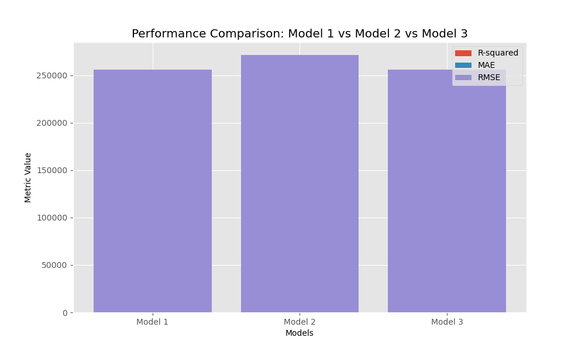

# House Price Prediction in King County

## Overview
This project aims to develop a regression model to predict house prices in King County. By analyzing various features of the houses, we aim to provide homeowners, real estate professionals, and researchers with a tool to estimate the selling price of a house in the region.

## Business and Data Understanding
The stakeholder audience for this project includes homeowners looking to sell their properties, real estate agents assisting with pricing decisions, and researchers studying the housing market in King County. The model can help homeowners determine an appropriate asking price, assist agents in setting competitive listing prices, and provide researchers with insights into the factors influencing house prices in the area.

## Data
The dataset used for this project consists of historical house sales data in King County. The data includes various features such as square footage, number of bedrooms and bathrooms, location, and other property characteristics. The dataset is representative of the housing market in King County and provides a comprehensive set of variables for our regression analysis.

## Modeling
We employed multiple linear regression to model the relationship between house prices and several independent variables. The key features considered in the analysis were grade, square footage (sqft_living), and the number of bathrooms. These features were selected based on their expected influence on house prices and their availability in the dataset.

## Regression Results
We developed three regression models, each with a different combination of features, to evaluate their performance in predicting house prices. The models were trained and evaluated using various metrics such as R-squared, mean absolute error (MAE), and root mean squared error (RMSE).

Model 1: This model included sqft_living, sqft_living15, grade, and bathrooms as independent variables. It achieved an R-squared value of 0.538, indicating that it can explain approximately 53.8% of the variability in house prices. However, the presence of high multicollinearity among the features compromised the reliability of the model.

Model 2: This model excluded sqft_living15 due to its high correlation with other features. It achieved an R-squared value of 0.473, indicating that it can explain approximately 47.3% of the variability in house prices. The removal of the highly correlated feature improved the model's interpretability and robustness.

Model 3: This model further refined the feature set by removing sqft_living15, which was highly correlated with sqft_living. It achieved an R-squared value of 0.537, indicating that it can explain approximately 53.7% of the variability in house prices. The model demonstrated better interpretability and addressed the issue of multicollinearity.

## Conclusion
In conclusion, the developed regression models provide a useful tool for estimating house prices in King County. The selected features, grade, sqft_living, and bathrooms, were found to have a significant impact on house prices. However, it's important to note that the models' predictions may not capture all the factors influencing house prices, and additional considerations such as location, amenities, and market trends should be taken into account.

The models' performance, as indicated by the R-squared values, show promise but also highlight the need for ongoing refinement and updates as new data becomes available. It's recommended to regularly retrain the models using the latest data to ensure their accuracy and relevance in the dynamic housing market.

The project demonstrates the potential of regression analysis in predicting house prices and provides valuable insights for homeowners, real estate professionals, and researchers interested in understanding the housing market dynamics in King County.
